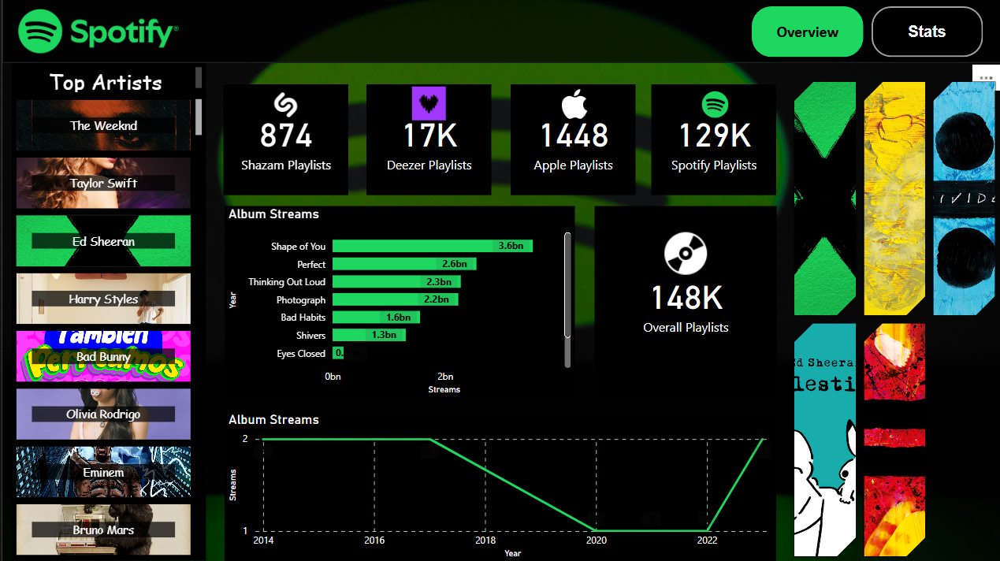

# 🎵 Spotify Data Analysis and Visualization 🎧

# 📌 Screenshot

# 📌 Project Overview

This project is a comprehensive Spotify Data Analysis and Visualization using Power BI and Python. The dataset was enriched with album cover URLs using the Spotify Developer API, and extensive data cleaning, transformation, and visualization were performed to extract meaningful insights about music trends, track popularity, and genre distribution.

🔹 Key Highlights:✅ Python + Power BI Integration for data preprocessing and interactive visualizations✅ Spotify API Usage to fetch album cover images dynamically✅ DAX-powered Analytics for in-depth music trend analysis✅ Visually Engaging Power BI Dashboard with filters & slicers for dynamic insights

# 🚀 Features

✨ Data Enrichment using Spotify API – Track album cover URLs added dynamically✨ Power Query Transformations – Data cleaning, type conversion & duplicate removal✨ DAX Measures & Calculations – Popularity scores, streaming trends & genre insights✨ Interactive Dashboard – Fully interactive with charts, filters & drill-through analysis✨ Data Modeling & Relationships – Structured Tracks, Artists, Albums & Genres tables✨ Album Cover Integration – Direct album image display in Power BI report

# 🛠️ Technologies Used

💻 Python (Pandas, Spotipy) – Data Extraction & Preprocessing🎵 Spotify API – Fetching track metadata & album cover images📊 Power BI – Data Modeling, Visualization & Dashboarding📈 DAX (Data Analysis Expressions) – Custom measures & analytics

# 📂 Project Structure

🔹 Data Preprocessing with Python

1️⃣ Loaded dataset using Pandas2️⃣ Authenticated with Spotify API using client credentials3️⃣ Extracted album cover URLs for each track4️⃣ Added new column track_album_url with album image URLs5️⃣ Saved the modified dataset for Power BI analysis

import pandas as pd
import spotipy
from spotipy.oauth2 import SpotifyClientCredentials

# Authenticate with Spotify API
client_id = "your_client_id"
client_secret = "your_client_secret"
sp = spotipy.Spotify(auth_manager=SpotifyClientCredentials(client_id, client_secret))
# Load dataset
df = pd.read_csv("spotify_data.csv")

# Function to fetch album cover URL
def get_album_url(track_name, artist_name):
    results = sp.search(q=f"track:{track_name} artist:{artist_name}", limit=1)
    if results['tracks']['items']:
        return results['tracks']['items'][0]['album']['images'][0]['url']
    return None

# Apply function to dataset
df["track_album_url"] = df.apply(lambda row: get_album_url(row["track_name"], row["artist_name"]), axis=1)

# Save updated dataset
df.to_csv("spotify_data_updated.csv", index=False)

# 🎨 Power BI Dashboard

# 📊 Visuals Included

📌 Top Artists & Tracks – Bar Chart📌 Streaming Trends Over Time – Line Chart📌 Genre Distribution – Treemap📌 Acoustic vs. Electronic Songs – Donut Chart📌 Music Feature Impact on Popularity – Waterfall Chart

# 🔗 Power BI Report Components

✅ Tracks Table – Track details, popularity & album images✅ Artists Table – Artist-wise insights✅ Albums Table – Album-level data✅ Genres Table – Grouping based on music styles

# 📈 DAX Measures for Analysis

📌 Total Streams – SUM(SpotifyData[streams])📌 Average Popularity – AVERAGE(SpotifyData[popularity])📌 Major vs. Minor Key Classification – CONCATENATE(SpotifyData[key], " ", SpotifyData[mode])

# 🔮 Future Improvements

🚀 Real-time Data Updates – Automate refresh using Spotify API🚀 Sentiment Analysis – Classifying songs based on lyrics' emotions🚀 Playlist Trends – Analyzing user-generated playlists🚀 Machine Learning Integration – Predicting song popularity trends

# 📢 How to Use

📌 Open Power BI Report:

Load Spotify.pbix in Power BI Desktop and explore the interactive dashboard

# 📩 Contact & Connect

📧 For any inquiries or collaborations, reach out via:🔗 LinkedIn - Navneeth C

🌟 If you like this project, don’t forget to ⭐ star the repository!
